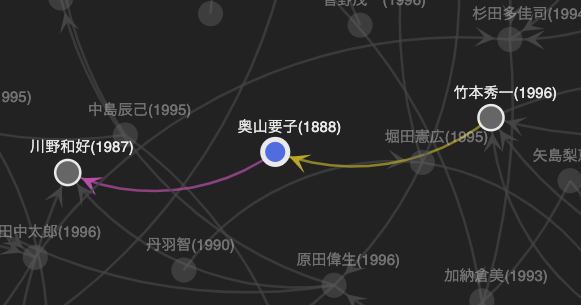

# relativez

relativezは文献の引用ネットワークを可視化するWebアプリケーションです。

[https://relativez.art/](https://mizunoshoji.github.io/relativez/)

- 企画：大原由
- 開発：水野翔司

## 目的

- 文献同士の関係を視覚化することで文脈が把握しやすくなること
- 情報量が増えたときに全体をイメージしやすくすること
- 研究に必要な文献情報を整理できること

relativezが想像する理想的なシーンは、複数の独立したアーティストが集まる場所において、個々人の持つ問題意識について、お互いがお互いにその複雑さを理解しつつ共通点を見出せる環境です。このWebアプリケーションが会話や勉強会など様々な場面で制作の一助になることを願っています。

## 主な機能

### データソース選択

 - relativezが独自に収集し提供する文献の引用関係データを、ネットワークグラフとしてWeb上で表現します。
 - 現状では主に芸術分野の文献データを収集して提供しています。

### データソース入力

 - ユーザーが作成した文献データと引用関係データを基にしたネットワークグラフを表示できます。
 - 下記のデータ作成用テンプレートをコピーまたはダウンロードしてからデータを作成してください。
   
   - [データ作成用テンプレート - relativez_data_template.v01](https://docs.google.com/spreadsheets/d/1AdNFTfCSotEPVilhd1EvE6poh1fSPZ5TjKZYU9LS318/edit?usp=sharing)
 
 - データ作成方法については、シート「データ作成マニュアル」を参照してください。

## ネットワークグラフ仕様

- 選択中の文献は青くハイライト表示されます。
- 選択中の文献が引用している文献はピンクの矢印で関連づけられます。引用関係を示します。
- 選択中の文献を引用している文献は黄色の矢印で関連づけられます。被引用関係を示します。

## データ提供者として参加する

データソースを作成して提供していただくと、relativezにアクセスした他のユーザーが閲覧可能なネットワークグラフとして表示します。「データソース選択」から提供していただいたデータが選択可能になります。relativezにデータを提供していただける方はTwitterのDMでご連絡ください。

[Twitter @relativez_2021](https://twitter.com/relativez_2021)

## ロードマップ

- 機能改善
 
  - グラフ内の複数の点を同時に選択し、移動する
  - リストを年の降順、昇順でソート

- 提供するデータソースをコンテンツとして充実させる。
- 外部のデータリソースとの連携は利用可能で良いリソースが見つかれば検討する。

## 寄付

relativezは今後の運営や開発等の費用を募っています。関心を持っていただいた方や、ご利用者の皆様からのご支援をお待ちしております。何卒よろしくお願い申し上げます。

[Square 寄付用ページ](https://checkout.square.site/merchant/ML6N1N81JA96Q/checkout/ZIJYYSIL6Q253UJW57XEDXIL?src=embed)

## バグ報告

バグを見つけた場合は下記のどちらかで問題を報告していただけるとありがたいです。プルリクエストも受け付けています。

- [Issues](https://github.com/mizunoshoji/relativez/issues)
- [Twitter @relativez_2021](https://twitter.com/relativez_2021)

## Release Note
### 2021.10.10 Ver 1.0
- Published

## License
MIT

## 開発者向けメモ

グラフ作成に[D3.js](https://d3js.org/)を利用していますが`package.json`では管理されていません。

